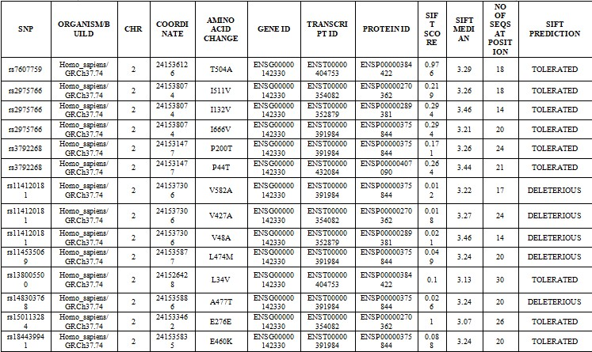

## CAPN10snp

## Uncovering Genetic Variations in the CAPN10 Gene: A Comprehensive SNP Analysis

## Table of Contents
1. [Introduction]("Introduction")
2. [Aim]("Aim")
3. [General Objectives]("General-Objectives")
4. [Methodology]("Methodology")
5. [Results]("Results")
6. [Expected Outcomes]("Expected_Outcomes")
7. [Team Members]("Team_Members")

### Introduction:
The CAPN10 gene, linked to susceptibility to type 2 diabetes mellitus (T2DM), has received significant attention for its involvement in regulating glucose metabolism. Here, we present an ongoing computational analysis focused on identifying potentially functional single nucleotide polymorphisms (SNPs) within CAPN10. Our study aims to distinguish harmful non-synonymous SNPs (nsSNPs) from neutral variants, utilizing various sequence and structure-based bioinformatic tools. Through a multimodal approach, we meticulously explore a range of nsSNPs, assessing their potential to impact protein structure and function. This comprehensive analysis marks a foundational step towards understanding the functional consequences of genetic variation in CAPN10, with implications for future studies in T2DM and cancer research, including personalized medicine initiatives.

### Aim
This project aims to conduct a comprehensive SNP analysis of the CAPN10 gene to identify potential functional variants associated with T2DM.

### General Objectives:
Retrieve SNP data: Collect high-quality SNP data within the CAPN10 gene region from public genomic databases such as NCBI dbSNP.

Functional annotation: Predict the functional significance of identified SNPs using bioinformatics tools such as SIFT and PolyPhen-2 to assess their potential impact on protein structure and function.

Linkage disequilibrium analysis: Investigate the patterns of linkage disequilibrium and identify haplotype blocks within the CAPN10 gene region to understand the genetic architecture.

Association analysis: Assess the association of identified SNPs with T2DM and cancer susceptibility using available genetic datasets and perform statistical analyses to determine their significance.

Functional validation: Validate the functional relevance of prioritized SNPs using in vitro assays or functional genomics approaches to elucidate their role in T2DM pathogenesis and carcinogenesis.

### Methodology:

Figure 1. Workflow

Data retrieval: SNP data within the CAPN10 gene region were retrieved from NCBI and dbSNP. Protein sequences from these genes were obtained and used for the second stage of analysis.

Functional annotation: The functional impact of the identified SNPs were predicted using a series of bioinformatics tools for a more comprehensive analysis. 

### Results

A total of 6922 SNPs of the human CAPN10 gene were retrieved from the dbSNP database (dbSNP NCBI: https://www.ncbi.nlm.nih.gov/snp). Out of which 662 were missense (nsSNP), 669 were non-coding transcripts, 349 were synonymous, 4561 were intronic, only 1 initiator codon variant, 3 inframe insertions, 2 inframe indels, and 2 inframe deletions. For the current study, only nsSNPs (missense) of CAPN10 were selected.
The Screening of functional Single nucleotide variants in CAPN10 was performed using a series of bioinformatics tools using the CAPN10 gene obtained from dbSNP. Different input queries (protein change, amino acid sequences, etc) were subjected to in-silico analysis through a variety of tools, which include SIFT, Align GVGD, Polyphen-2, and PANTHER. The following figures represent the output that were obtained.

Figure 2. SIFT analysis

Figure 3. Align GVGD analysis

Figure 4. PANTHER analysis

Figure 5. Free Energy Stability

Figure 6. Protein-Protein interactions of CAPN10 with 10 proteins based on experimental data and curated databases.

Figure 7. HOPE analysis showing structural changes in the amino acids

Figure 8. The 3D model of the CAPN10 protein using AlphaFold. 

Figure 9. Ramachandran plot
consurf Analysis:

Structural assessments using QMEAN, ProSA, Procheck and MolProbity were also carried out. The Ramachandran plot shows 93.8% of the amino acids in the favored region. MolProbity score of 1.14 was recorded for the model. ProSA reveals an overall model quality Z-score of -9.28 showing that the model is within the range of scores typically found for native proteins of similar size.
### Prediction and Assessment of Modeled Structure
#### I-TASSER 3d Structure Prediction

Model 1

Model 2

Model 3

Model 4

Model 5

The 5 models predicted by I-TASSER, with the C-score=-0.86 for Model 1, C-score = -1.00 for Model 2, C-score = -0.61 for Model 3, C-score = -3.14 for Model 4, C-score = -3.64 for Model 5 each. The confidence of each model is quantitatively measured by a C-score that is calculated based on the significance of threading template alignments and the convergence parameters of the structure assembly simulations. C-score is typically in the range of [-5, 2], where a C-score of a higher value signifies a model with a higher confidence and vice-versa(ref)
7. Three-dimensional modeling of the mutated protein
gene expression Association analysis: 
association of CAPN-10 with various genes and theor expression in various diseases

<!--### Linkage disequilibrium analysis: 
Analyze linkage disequilibrium patterns and identify haplotype blocks using statistical methods.

###  

### Functional validation: 
Validate the functional relevance of prioritized SNPs using experimental assays or functional genomics approaches.

### Catalog of identified SNPs within the CAPN10 gene.
Assessment of functional significance for prioritized SNPs.

Identification of haplotype blocks and linkage disequilibrium patterns within CAPN10.

Association analysis results linking specific SNPs to various disorders.

Functional validation of selected SNPs to elucidate their role in T2DM pathogenesis.-->

### Expected Outcomes:
1.Identification of non-synonymous SNPs (nsSNPs), exploring the possibility that they may alter the structure and function of proteins.

2.Identification of Asssociated disease with human CAPN10 gene.

### Team Members: 
1. Shivani Pawar
2. Nigel Dolling
3. Musa Muhammad Shamsuddeen
4. Gershom Olajire
5. Purity Njenga

