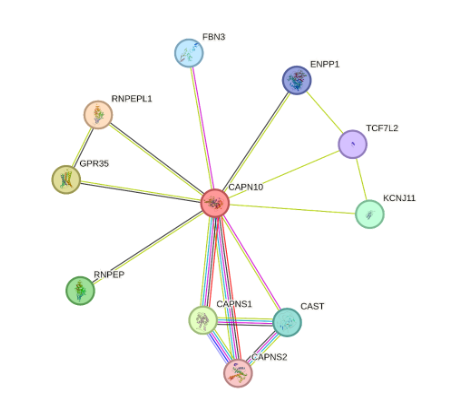

## CAPN10snp

## Uncovering Genetic Variations in the CAPN10 Gene: A Comprehensive SNP Analysis

## Table of Contents
1. [Introduction]("Introduction")
2. [Aim]("Aim")
3. [General Objectives]("General-Objectives")
4. [Workflow]("Workflow")
5. [Methodology]("Methodology")
6. [Results]("Results")
7. [Conclusions]("Conclusions")
8. [Team Members]("Team_Members")

### Introduction:
The CAPN10 gene, linked to susceptibility to type 2 diabetes mellitus (T2DM), has received significant attention for its involvement in regulating glucose metabolism. Here, we present a computational analysis focused on identifying potentially functional and harmful single nucleotide polymorphisms (SNPs) within CAPN10. Our study aims to distinguish harmful non-synonymous SNPs (nsSNPs) from neutral variants, utilizing various sequence and structure-based bioinformatic tools. Through a multimodal approach, we have been able to meticulously explore a range of nsSNPs, assessing their potential to impact protein structure and function. 

A total of 6922 single nucleotide polymorphisms (SNPs) were found within the CAPN10 gene, among which 662 were identified as missense variants. These SNPs underwent thorough analysis using bioinformatics tools to predict their impacts on function and structure.

### Aim
This project aims to conduct a comprehensive SNP analysis of the CAPN10 gene to identify potential functional variants associated with T2DM.

### General Objectives:
1. SNP data Retrieval from NCBI and dbSNP
2. Identification of potentially harmful SNPS
3. Characterization of functional variants
4. Understanding association of CAPN10 with type 2 diabetes mellitus (T2DM) pathogenesis.
5. Comorbidity and Disease Associations

### Workflow:

Figure 1. Workflow

### Methodology:
1. #### Retrieval of Single Nucleotide Polymorphisms (SNPs).
Data related to the human CAPN10 gene and its protein sequence (FASTA format) was retrieved from NCBI (https://www.ncbi.nlm.nih.gov/). SNPs located in the CAPN10 gene were retrieved from dbSNP database (http://www.ncbi.nlm.nih.gov/SNP/)

2. #### Identification and prediction of the effect of deleterious and Tolerant SNPs
The following set of online tools were used to examine the functional and structural effects of harmful SNPs in the CAPN10 gene:

i) SIFT (Sorting Intolerant from Tolerant) (https://sift.bii.a-star.edu.sg/) determines the deleterious/harmful (probability score <0.05) and tolerated SNPs (probability score >= 0.05) based on sequence homology. This prediction helps to analyze the impact of amino acid variation on phenotypic and functional changes in protein molecules.

ii) The Align GVGD (http://agvgd.hci.utah.edu/) is a web-based tool which predicts whether missense substitution is deleterious or neutral. Protein multiple sequence alignments and the physicochemical properties of amino acids are highlighted in this prediction. Variants are usually grouped into different classes based on their likelihood to interfere with cellular function. The classification includes C0, C15, C25, C35, C45, C55 and C65 where C55 and C65 are most likely to interfere with function and C15 is less likely to affect.

iii) PolyPhen-2, or Polymorphism Phenotyping v2 (http://genetics.bwh.harvard.edu/pph2/), was used to investigate the potential impact of an amino acid substitution on the structure and function of proteins. This web-based tool supplied the quantity and specifics of the amino acid replacement. The PolyPhen-2 score, which ranges from 0.0 to 1.0, reveals whether alteration in a certain amino acid is beneficial or harmful.

iv) PANTHER cSNP (Protein analysis through evolutionary relationship-coding SNP) (http://pantherdb.org/tools/csnpScoreForm.jsp) classification system works based on the evolutionary relationship and interactions that exist between proteins and their molecular functions. This tool provides scores based on position-specific evolutionary conservation (PSEC) by estimating how various evolutionarily related proteins are aligned.

3. #### Protein stability and free energy change prediction
I-Mutant2.0 (https://folding.biofold.org/cgi-bin/i-mutant2.0.cgi) is a tool that utilizes support vector machine (SVM) technology to automatically forecast protein stability changes due to mutations. It serves as both a classifier, determining the direction of the stability change, and a regression estimator, predicting the magnitude of the free energy stability change (ΔΔG) resulting from mutation.

4. #### Evaluation of conservation profile of CAPN10
The ConSurf server ( https://consurf.tau.ac.il/) is used to determine the evolutionary conservation of the positions of amino acids of a particular protein while revealing regions that are important for structure and function of that protein.  The input data is used to determine the evolutionary rate of each amino acid position using probabilistic models such as an empirical Bayesian method or maximum likelihood method. A graded color scale is used to depict the conservation score ranging from 1 to 9 which is classified as variable, average and conserved.

5. #### Analysis of structural effect of nsSNPs
The structural impact of non-synonymous single nucleotide polymorphisms (nsSNPs) was assessed through the tool HOPE (Have (y) Our Protein Explained) (https://www3.cmbi.umcn.nl/hope/). By utilizing protein sequence and mutation data as input queries, HOPE generates a comprehensive report detailing the mutation's influence on protein structure and function.

6. #### Protein-protein interaction prediction
Search Tool for the Retrieval of Interacting Genes/Proteins (STRING) (https://string-db.org/cgi) is an extensively utilized database and online tool designed to aggregate, assess, and merge publicly accessible sources of information on protein-protein interactions (PPI).  It integrates data from various sources, including experimental studies, computational predictions, and text collections.

7. #### Prediction and Assessment of Modeled Structure
AlphaFold (https://alphafold.ebi.ac.uk/) created by DeepMind, is a neural network-based approach designed to predict protein structures based on amino acid sequences. It has demonstrated notable precision in predicting protein structures, achieving atomic-level accuracy even in instances lacking a homology structural reference.

8. #### Evaluation and Prediction of the CAPN10 Protein's Three-Dimensional Structure
Iterative Threading ASSEmbly Refinement (I-TASSER) is a hierarchical method for both structure-based function annotation and protein structure prediction (https://zhanglab.dcmb.med.umich.edu/I-TASSER/). It typically delivers the top 5 models of the desired protein and finds structural templates from the PDB to produce the most suitable protein structure.

9. #### Three-Dimensional modeling of the mutated protein
A point mutation was generated at a specific location in the native protein sequence, and the modified protein's structural analysis was conducted using SWISS--MODEL (https://swissmodel.expasy.org/). Next, the TM-align tool (https://zhanglab.dcmb.med.umich) was used to analyze the modified model.

10. #### Analysis of gene expression and overall survival rate
The RNA sequencing expression data from the Genotype-Tissue Expression (GTEx) and Cancer Genome Atlas (TCGA) projects are analyzed using the interactive database GEPIA (Gene Expression Profiling Interactive Analysis) (http://gepia.cancer-pku.cn/). It provides survival analysis using the logrank test and expression patterns of a specific gene in dot or box plots. The candidate gene's name CAPN10 was entered into both analyses.

11. #### Identification of T2DM Association with nsSNPs
Among selected variants in this study, Uniprot Database (https://www.uniprot.org/uniprotkb) was used to assess the amino acid mutations in this study and analyze the amino acid mutations and structural alterations caused by these variants that result in a change in the protein function leading to the risk of developing Type II Diabetes.

12. #### Cancer Association with casp8 gene:
The canSAR black web based tool (https://cansar.ai/) revealed disease types, signaling, ligandability and the association of cancer with clinical score and mutation score. For mutation score the clinical score for endometrial cancer is 0.12. In combined molecular score, the breast cancer clinical score is 0.22, endometrial cancer clinical score is 0.18, cervical cancer clinical score is 0.19.

13. #### Analysis of correlation of gene expression and mutation:
The muTarget tool (https://www.mutarget.com/) was used to identify genes whose mutations impact the expression of the target gene in addition to those whose expression in the query gene is altered.

### Results

A total of 6922 SNPs of the human CAPN10 gene were retrieved from the dbSNP database (dbSNP NCBI: https://www.ncbi.nlm.nih.gov/snp). Out of which 662 were missense (nsSNP), 669 were non-coding transcripts, 349 were synonymous, 4561 were intronic, only 1 initiator codon variant, 3 inframe insertions, 2 inframe indels, and 2 inframe deletions. However, only nsSNPs (missense) of CAPN10 were selected for this study.

                                               

Figure 2. SIFT analysis                                                            Figure 3. Align GVGD analysis

Figure 4. PANTHER analysis

Figure 5. Free Energy Stability

Figure 6. Protein-Protein interactions of CAPN10 with 10 proteins based on experimental data and curated databases.

Figure 7. HOPE analysis showing structural changes in the amino acids

Figure 8. The 3D model of the CAPN10 protein using AlphaFold. 

Figure 9. Ramachandran plot
consurf Analysis:

### Prediction and Assessment of Modeled Structure
Swiss Model was used in generating 7 models based on analogs of the provided sequence of CAPN10 retrieved from UniProt. Structural assessments using QMEAN and MolProbity were carried out.

#### I-TASSER 3d Structure Prediction

Model 1

Model 2

Model 3

Model 4

Model 5

The 5 models predicted by I-TASSER, with the C-score=-0.86 for Model 1, C-score = -1.00 for Model 2, C-score = -0.61 for Model 3, C-score = -3.14 for Model 4, C-score = -3.64 for Model 5 each. The confidence of each model is quantitatively measured by a C-score that is calculated based on the significance of threading template alignments and the convergence parameters of the structure assembly simulations. C-score is typically in the range of [-5, 2], where a C-score of a higher value signifies a model with a higher confidence and vice-versa(ref)
7. Three-dimensional modeling of the mutated protein
gene expression Association analysis: 
### Association of CAPN-10 With Various Genes and their Expression in Various Diseases

### Cancer Association Analysis Using canSARblack:

### Expression Plot:

.png)
### T2D Association:Structural Alterations in CAPN10:
    
     
 
 
 ![image]
### Conclusions

This research was able to identify numerous nsSNPs with potentially harmful effects, indicating modifications in protein structure and function. Notably, variants V427A, R44T, and A132V demonstrated higher scores, implying their possible detrimental effects. This offers a comprehensive understanding of the functional consequences of genetic variations within CAPN10, shedding light on its involvement in both type 2 diabetes mellitus (T2DM) susceptibility and cancer pathogenesis. These findings shall serve as a valuable data for future population-based studies and personalized medicine initiatives in T2DM and cancer research. It would also bridge the knowledge gap between the association of CAPN10 with type 2 diabetes mellitus (T2DM) pathogenesis

### Team Members: 
1. Shivani Pawar
2. Nigel Dolling
3. Musa Muhammad Shamsuddeen
4. Gershom Olajire
5. Purity Njenga

